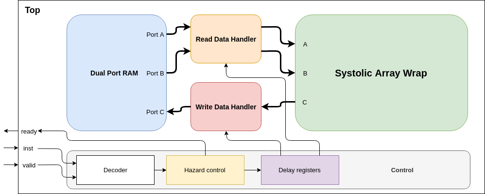

# matrix-multiply-accelerator

> Dependencies: Docker. 

---

## Setup

In order to be able to compile and execute the scripts, you need to source the env script at the root of the repo. This will download a docker image with all the dependencies installed, which will be used for all the scripts.

```
git clone https://github.com/ying27/matrix-multiplication-accelerator.git
cd matrix-multiplication-accelerator
source env.sh
```

## Compilation

In order to compile the testbenches you can use the following instruction:

```
compile --top TB_TOP_NAME [--trace] [--test TESTNAME]
```

The testbench is suposed to be found at ```$REPOROOT/tb/TB_TOP_NAME/TB_TOP_NAME.sv```. All the files in the folder will be added to the compilation.

The ```--trace``` option is necessary in order to be able to produce a trace.

The specific test folder is expected to be found at ```$REPOROOT/tb/TB_TOP_NAME/tests/TESTNAME```. All the files in the folder will be soft-linked to the execution folder.

## Execution

The tests can be run by using:

```
run TB_TOP_NAME [--timeout TIMEOUT(default=1000)] [--trace TRACE_FILE.fst]
```

This tool only works if the model has been previously compiled using the aforementioned tool.

The ```--timeout``` option specifies the maximum amount of cycles that will be simulated.

The ```--trace``` option allows for the enables of a trace file. If the test has not been compiled with the ``--trace`` option this parameter will be ignored.

## Overview of the system


